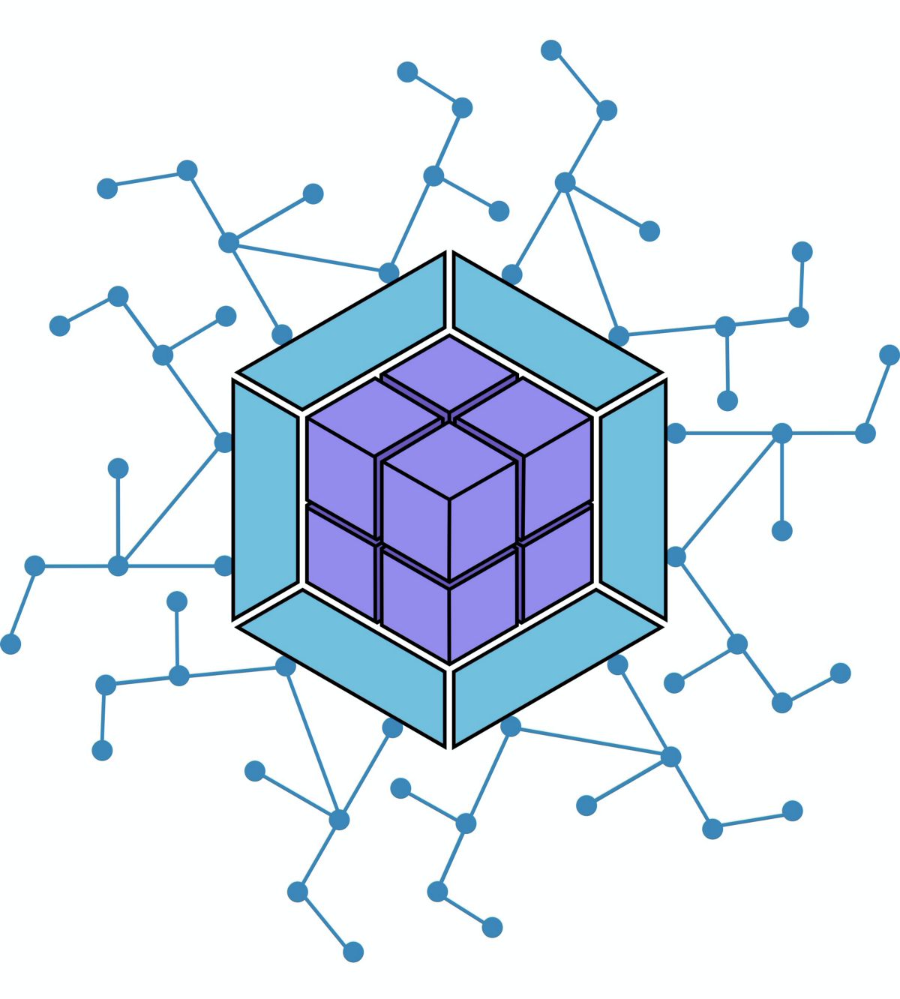

# Workshop: Basic Microfrontends in React
A workshop geared to help you create your first microfrontend using react and module federation. This course will give you the basics of the technology that makes it possible and how it all works together. All of the code will be operating in a monorepo for convenience and ease of adoption. 

### Time frame
This course should take 1-3 hours depending on your proficiency.

### Prerequisites 
- Intermediate hands on experience in React.
- Basic knowledge of Http Methods and javascript loading.

## ▪️ What is a Microfrontend Architecture?

Microfrontend architecture is an approach to breaking up your front-end into a set of independently deployable, loosely coupled applications and/or components. These applications are then assembled together to act as a single user experience, once deployed. We do this using a new technology called Module Federation. We have a single Host application which wraps up our single page applications represented as remotes.

### What are hosts and remotes?

When we talk about micro-frontends, we often use words like `HOST` and `REMOTE`. A host is a parent application that ties all remotes together. A remote can be many things, but in the context of what we will be learning, a remote is essentially a single page react application. 

Often time a host can extend configuration, security, types, routing, and many other features to remotes, so that each remote does not have to implement them individually.

## ▪️ What will we be building?
In this workshop we are going to build a simple application which allows you to view a list of movies and then look at additional details about a select movie. The application will use React, javascript, bootstrap css, module federation, and webpack.

### Solution Structure
For now we will keep the structure loose and simple to understand:

```
.
├── 📁 host
│   ├── 📁 public
│   ├── 📁 src
│   │   ├── 📁 components
│   │   ├── 📁 pages
│   │   ├── 📄 routing.jsx
│   │   └── 📄 index.jsx
│   ├── 📄 webpack.config.js
│   └── 📄 package.json
├── 📁 remotes
│   ├── 📁 home
│   │   ├── 📁 public
│   │   ├── 📁 src
│   │   │   ├── 📄 app.jsx
│   │   │   ├── 📄 bootstrap.jsx
│   │   │   └── 📄 index.jsx
│   │   ├── 📄 webpack.config.js
│   │   └── 📄 package.json
│   ├── 📁 list-movies
│   │   └── . . .
│   └── 📁 view-movie
│       └── . . .
├── 📄 package.json
└── 📄 pnpm-workspace.yaml
```

## ▪️ Getting started

1) First off we want to branch or fork this repository. 

2) Secondly we want to create a default package to manage the solution using pnpm and setup pnpm to manage our workspaces. Open a terminal in this directory and execute 
    ```
    npm install -g pnpm
    pnpm init
    ``` 

3) Next we want to create a few directories and populate them. 
    ```
    mkdir host
    mkdir remotes
    mkdir remotes/home
    mkdir remotes/list-movies
    mkdir remotes/view-movie
    ```
4) Now lets generate our host using create-react-app
    ```
    pnpm create react-app host
    ```