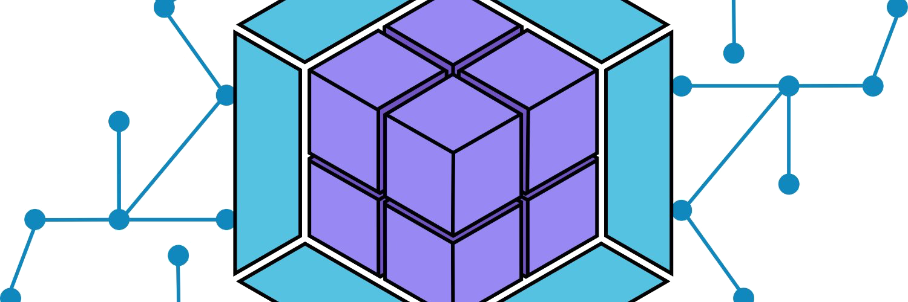
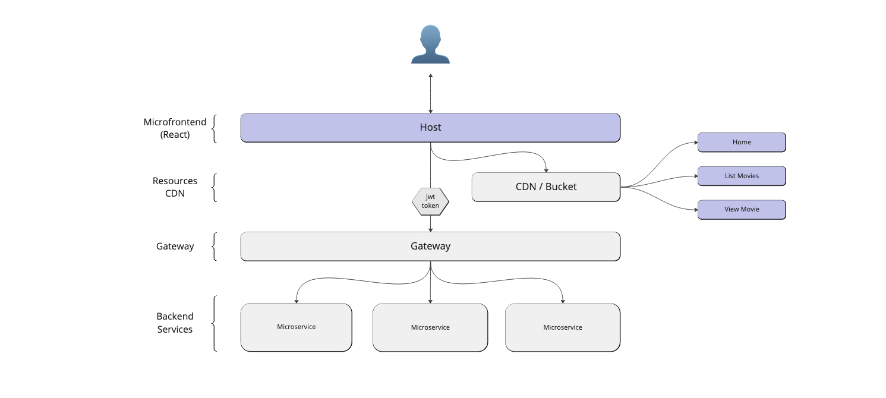
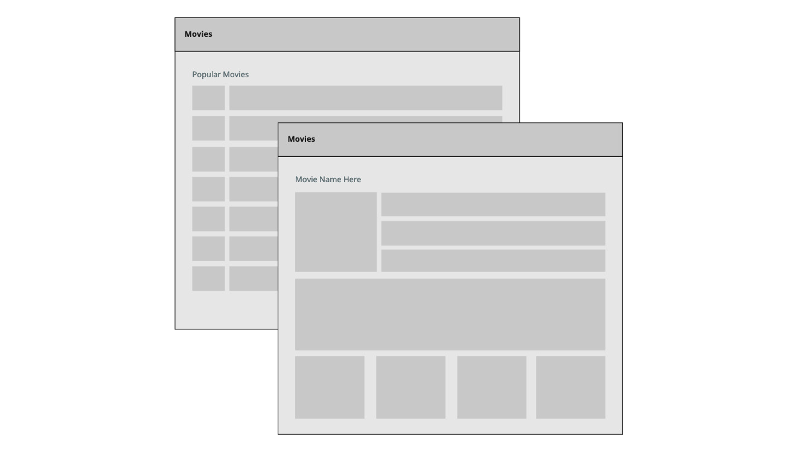

# Workshop: Microfrontend Solution Architecture in React
A workshop geared to help you create your first microfrontend using react and module federation. This course will give you the basics of the technology that makes it possible and how it all works together. All of the code will be operating in a monorepo for convenience and ease of adoption. 

### Time frame
This course should take 1-3 hours depending on your proficiency.

### Prerequisites 
- Intermediate hands on experience in React.
- Basic knowledge of Http Methods and javascript loading.

## ▪️ What is a Microfrontend Architecture?

Microfrontend architecture is an approach to breaking up your front-end into a set of independently deployable, loosely coupled applications and/or components. These applications are then assembled together to act as a single user experience, once deployed. We do this using a new technology called Module Federation. We have a single Host application which wraps up our single page applications represented as remotes.



## ▪️ Module Federation

Module Federation aims to solve the sharing of modules in a distributed system, by shipping those critical shared pieces as macro or as micro as you would like. It does this by pulling them out of the the build pipeline and out of your apps.

More information here: [Module Federation](https://webpack.js.org/concepts/module-federation/)

There are two main concepts to get your head around; the Host and the Remote's.

### What are hosts and remotes?

When we talk about micro-frontends, we often use words like `HOST` and `REMOTE`. A host is a parent application that ties all remotes together. A remote can be many things, but in the context of what we will be learning, a remote is essentially a single page react application. 

Often time a host can extend configuration, security, types, routing, and many other features to remotes, so that each remote does not have to implement them individually.

### Three ways of loading remotes

- **Eager:** Load all remotes up front inside the host's webpack.config.js. Must have knowledge of all remotes at startup.
- **Dynamic:** Load a single remote using React.Lazy on demand only when requested. Must have knowledge of only the requested remote when you view that page or component.
- **Delegated:** Prefetch all remotes on load, but only load them when requested. Must have knowledge of all remotes on load, but they do not need to be available on load.

## ▪️ What will we be building?
In this workshop we are going to build a simple application which allows you to view a list of movies and then look at additional details about a select movie. The application will use React, javascript, bootstrap css, module federation, and webpack.



### Solution Structure
For now we will keep the structure loose and simple to understand:

```
.
├── 📁 host
│   ├── 📁 public
│   ├── 📁 src
│   │   ├── 📁 components
│   │   ├── 📁 pages
│   │   ├── 📄 routing.jsx
│   │   └── 📄 index.jsx
│   ├── 📄 webpack.config.js
│   └── 📄 package.json
├── 📁 remotes
│   ├── 📁 home
│   │   ├── 📁 public
│   │   ├── 📁 src
│   │   │   ├── 📄 app.jsx
│   │   │   ├── 📄 bootstrap.js
│   │   │   └── 📄 index.js
│   │   ├── 📄 webpack.config.js
│   │   └── 📄 package.json
│   ├── 📁 list-movies
│   │   └── . . .
│   └── 📁 view-movie
│       └── . . .
├── 📄 package.json
└── 📄 pnpm-workspace.yaml
```

## ▪️ Getting started

1) First off we want to branch or fork this repository. 

2) Secondly we want to create a default package to manage the solution using pnpm and setup pnpm to manage our workspaces. Open a terminal in this directory and execute 
    ```
    npm install -g pnpm
    pnpm init
    ``` 

3) Next we want to create a few directories that represents our solution structure. 
    ```
    mkdir host
    mkdir remotes
    mkdir remotes/home
    mkdir remotes/list-movies
    mkdir remotes/view-movie
    ```

4) Now lets setup our host: First we want to copy down the minimal react mfe template from:
```
    https://github.com/cfryerdev/mfe-reactjs-template
```
_Put this in the `host` folder and take a moment to explore the directory and see whats inside._

5) Lets configure the project we just copied and make sure it will function as a container for our remotes.
    - First we want to go into `webpack.config.js` and look at the three main variables at the top, by default this is setup for host.
    - Since this is the host, we dont really have to do much else here.

6) Lets copy down the minimal react mfe template again into each of the remote folders. Lets start with the Home remote...
```
    https://github.com/cfryerdev/mfe-reactjs-template
```
_Put this in the `remotes/home` folder._

7) Lets configure the project we just copied and make sure it will function as a a remote.
    - First we want to go into `webpack.config.js` and look at the three main variables at the top, by default this is setup for host, so we need to name this `remote_home` by using the `_packageName` variable.
    - We need to update the `_port` variable to `3001`. We increment this for each remote.

8) Lets copy down the minimal react mfe template again into each of the remote folders. Lets setup the List Movies remote...
```
    https://github.com/cfryerdev/mfe-reactjs-template
```
_Put this in the `remotes/list-movies` folder._

9) Lets configure the project we just copied and make sure it will function as a a remote.
    - First we want to go into `webpack.config.js` and look at the three main variables at the top, by default this is setup for host, so we need to name this `remote_listmovies` by using the `_packageName` variable.
    - We need to update the `_port` variable to `3002`. We increment this for each remote.

10) Lets copy down the minimal react mfe template again into each of the remote folders. Lets setup the View Movie remote...
```
    https://github.com/cfryerdev/mfe-reactjs-template
```
_Put this in the `remotes/view-movie` folder._

11) Lets configure the project we just copied and make sure it will function as a a remote.
    - First we want to go into `webpack.config.js` and look at the three main variables at the top, by default this is setup for host, so we need to name this `remote_viewmovie` by using the `_packageName` variable.
    - We need to update the `_port` variable to `3003`. We increment this for each remote.

12) Lets create our pnpm workspace so its easier to run and build our solution. In the root of the directory, create a file called `pnpm-workspace.yaml` and put the following inside:
```
    packages:
      - host
      - remotes/home
      - remotes/list-movies
      - remotes/view-movie
```

13) Lets create package.json in our root directory, this will have the scripts we need for local development and building...

```
{
    "name": "workshope-mfe-react",
    "version": "1.0.0",
    "scripts": {
        "install": "",
        "start": "concurrently \"npm run start:home\" \"npm run start:list-movies\" \"npm run start:view-movie\" \"npm run start:host\"",

        "install:host": "cd host && npm install",
        "start:host": "cd host && npm start",
        "build:host": "cd host && npm run build",

        "install:home": "cd remotes && cd home && npm install",
        "start:home": "cd remotes && cd home && npm start",
        "build:home": "cd remotes && cd home && npm run build",

        "install:list-movies": "cd remotes && cd list-movies && npm install",
        "start:list-movies": "cd remotes && cd list-movies && npm start",
        "build:list-movies": "cd remotes && cd list-movies && npm run build",

        "install:view-movie": "cd remotes && cd view-movie && npm install",
        "start:view-movie": "cd remotes && cd view-movie && npm start",
        "build:view-movie": "cd remotes && cd view-movie && npm run build"
    },
    "dependencies": {
        "concurrently": "^7.0.0"
    }
}
```

14) We should now be able to run the project and make sure each stand up correctly:
```
    pnpm i
    pnpm start
```

You should be able to look through the console and see all three are available. Click the following urls and make sure they display `"React Minimal MFE Template"`:

- [https://localhost:3000/](http://localhost:3000)
- [https://localhost:3001/](http://localhost:3001)
- [https://localhost:3002/](http://localhost:3002)
- [https://localhost:3003/](http://localhost:3003)

If these are all returning correctly, move on, otherwise re-assess the steps above or look at the troubleshooting section.

15) We should be ready to start building our UI and see how it all ties together!

## ▪️ Building the UI....

tbd

## ▪️ Time to run the solution!

Its time to run the project! Open a terminal in the root of the solution and type:
```
pnpm i
pnpm start
```

It should all spin up in parallel and you can visit: [https://localhost:3000/](https://localhost:3000/)

## Solution Review

Now lets sit and talk about what we just built and the WHY behind the patterns you saw.

## ▪️ Common Questions
Here are some common questions I am often asked:

- **How often or under what circumstances would I create a new host?** Coming soon...
- **Can I use other frameworks instead of React?** Coming soon...
- **What if I want to use NextJS or Remix for my host?** Coming soon...